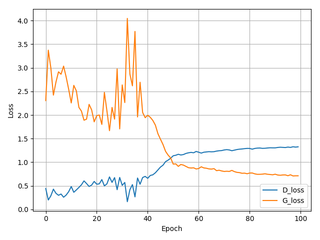

# tensorflow-MNIST-GAN
Tensorflow implementation of Generative Adversarial Networks (GAN) [1] and Deep Convolutional Generative Adversarial Networks (DCGAN) [2] for MNIST [3] dataset.

* you can download
  - MNIST dataset: http://yann.lecun.com/exdb/mnist/
 
## Resutls
* Generate using fixed noise (fixed_z_)

<table align='center'>
<tr align='center'>
<td> GAN</td>
<td> DCGAN</td>
</tr>
<tr>
<td>
<td>
</tr>
</table>

* MNIST vs Generated images

<table align='center'>
<tr align='center'>
<td> MNIST </td>
<td> GAN after 100 epochs </td>
<td> DCGAN agter 20 epochs </td>
</tr>
<tr>
<td>
<td>
<td>
</tr>
</table>

* Training loss

* Learning time
    * MNIST GAN - Avg. per epoch: 4.97 sec; Total 100 epochs: 1255.92 sec
    * MNIST DCGAN - Avg. per epoch: 175.84 sec; Total 20 epochs: 3619.97 sec

## Development Environment

* Windows 7
* GTX1080 ti
* cuda 8.0
* Python 3.5.3
* tensorflow-gpu 1.2.1
* numpy 1.13.1
* matplotlib 2.0.2
* imageio 2.2.0

## Reference

[1] Goodfellow, Ian, et al. "Generative adversarial nets." Advances in neural information processing systems. 2014.

(Full paper: http://papers.nips.cc/paper/5423-generative-adversarial-nets.pdf)

[2] Radford, Alec, Luke Metz, and Soumith Chintala. "Unsupervised representation learning with deep convolutional generative adversarial networks." arXiv preprint arXiv:1511.06434 (2015).

(Full paper: https://arxiv.org/pdf/1511.06434.pdf)

[3] Y. LeCun, L. Bottou, Y. Bengio, and P. Haffner. "Gradient-based learning applied to document recognition." Proceedings of the IEEE, 86(11):2278-2324, November 1998.
